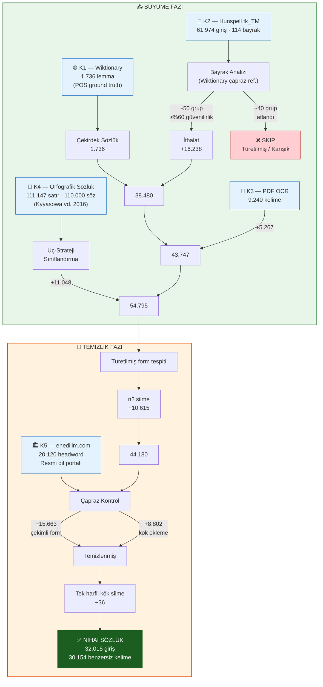
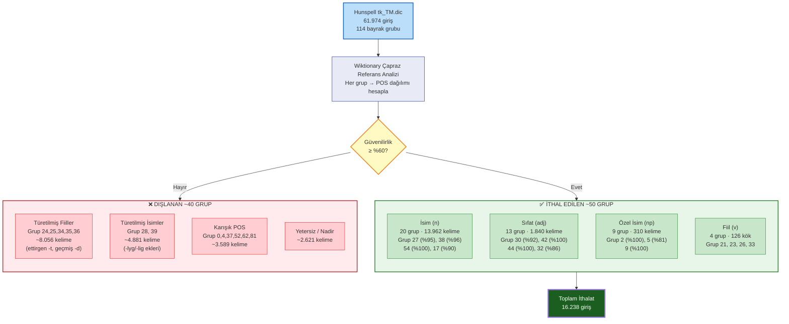
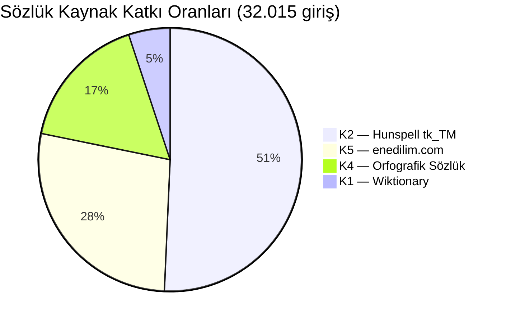
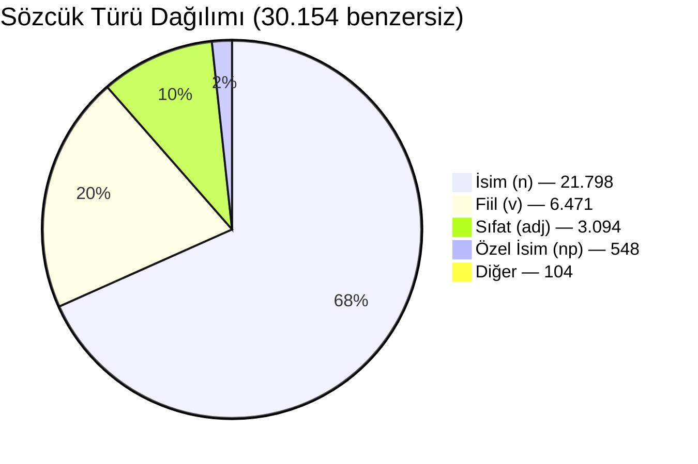

# Mermaid Diyagram Şablonları — §5 Sözlük Derleme Süreci

> **Kullanım:** Bu kodları https://mermaid.live adresine yapıştırarak PNG olarak indirebilirsiniz.
> Her diyagramı ayrı ayrı yapıştırın. Dikey format kullanılmıştır (TD = Top-Down).

---

## Şekil 2 — Sözlük Derleme Hattı Akış Diyagramı

**Konumu:** §5.2 Derleme Süreci paragrafından sonra, Tablo 4'ten önce.

---

## Şekil 3 — Hunspell Bayrak Grubu Analiz ve Filtreleme Süreci

**Konumu:** §5.3 Hunspell Bayrak Grubu Analiz Yöntemi bölümünde, Tablo 6'dan önce.

---

## Şekil 4 — Otomatik Sözlük Doğrulama Sonuçları Özeti

**Konumu:** §5.5.3 Otomatik Doğrulama başlangıcında veya sonunda.

```mermaid
flowchart TD
    DICT["Nihai Sözlük\n32.015 giriş\n30.154 benzersiz"]
    
    DICT --> V1
    DICT --> V2
    DICT --> V3
    DICT --> V4
    
    subgraph V1["§1 GENEL KALİTE"]
        direction TB
        V1A["Duplikasyon: 0 ✅"]
        V1B["Geçersiz karakter: 475\n(%1,6 hata oranı)"]
        V1C["K4 kapsamı: %75,0\n(22.609 / 30.154)"]
    end
    
    subgraph V2["§2 HUNSPELL KÖK KONTROLÜ"]
        direction TB
        V2A["Kontrol: 26.434"]
        V2B["Doğrulanan kök:\n16.874 (%63,8) ✅"]
        V2C["Türetilmiş şüpheli:\n2.795 (%10,6)\n(kasıtlı — leksikalleşmiş)"]
    end
    
    subgraph V3["§3 POS DOĞRULUĞU"]
        direction TB
        V3A["İsim→Fiil çakışma: 19\n(tamamı multi-POS) ✅"]
        V3B["İsim→Sıfat belirsizlik: 988\n(-ly/-syz ekleri)\n(Türk dili özelliği)"]
        V3C["Hunspell POS farkı: 1.727\n(bayrak grubu sınırlılığı)"]
    end
    
    subgraph V4["§4 FİİL ÇEKİM KONTROLÜ"]
        direction TB
        V4A["6.471 kök × 9 zaman\n= 58.239 form üretildi"]
        V4B["K4 eşleşme: %1,3\n(beklenen — K4 sözlük,\nderlem değil) ✅"]
        V4C["En yüksek: FÖ ortaç\n%10,2 (leksikalleşmiş)"]
    end
    
    style DICT fill:#1565c0,color:#fff,stroke-width:3px
    style V1 fill:#e8f5e9,stroke:#2e7d32,stroke-width:2px
    style V2 fill:#e3f2fd,stroke:#1565c0,stroke-width:2px
    style V3 fill:#fff3e0,stroke:#e65100,stroke-width:2px
    style V4 fill:#f3e5f5,stroke:#6a1b9a,stroke-width:2px
```

---

## Şekil 5 — Kaynak Katkı Oranları (Pasta Grafik)

**Konumu:** §5.1 Kaynaklar bölümünde Tablo 1'den sonra (opsiyonel).

---

## Şekil 6 — POS Dağılımı (Pasta Grafik)

**Konumu:** §5.6 Sözcük Türü Dağılımı bölümünde Tablo 8'den sonra (opsiyonel).

